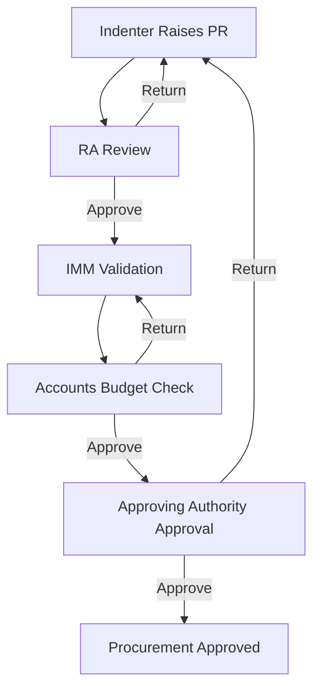
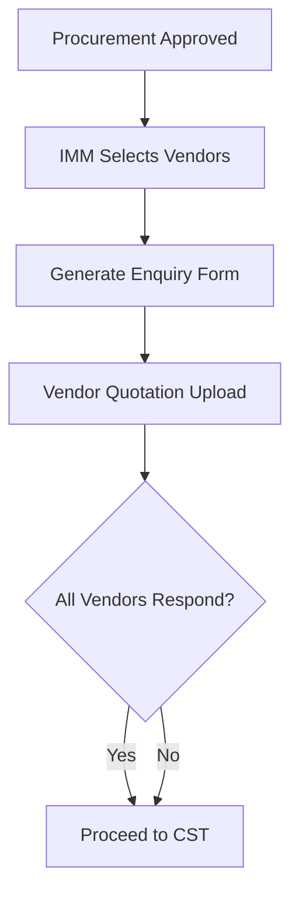
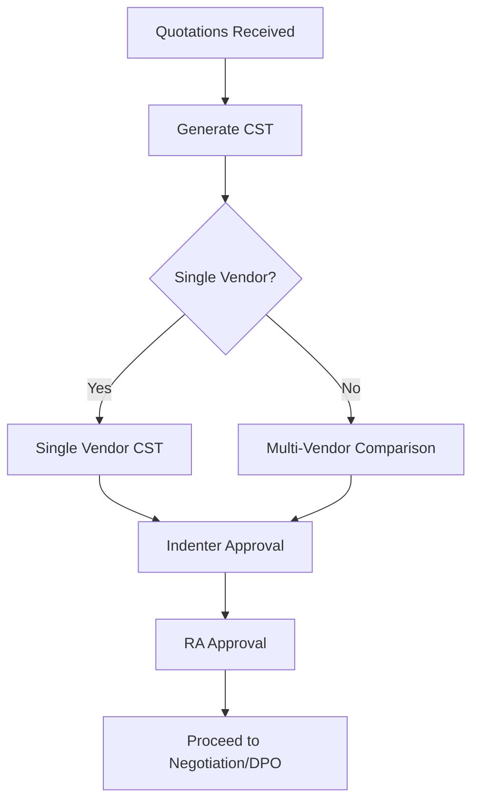
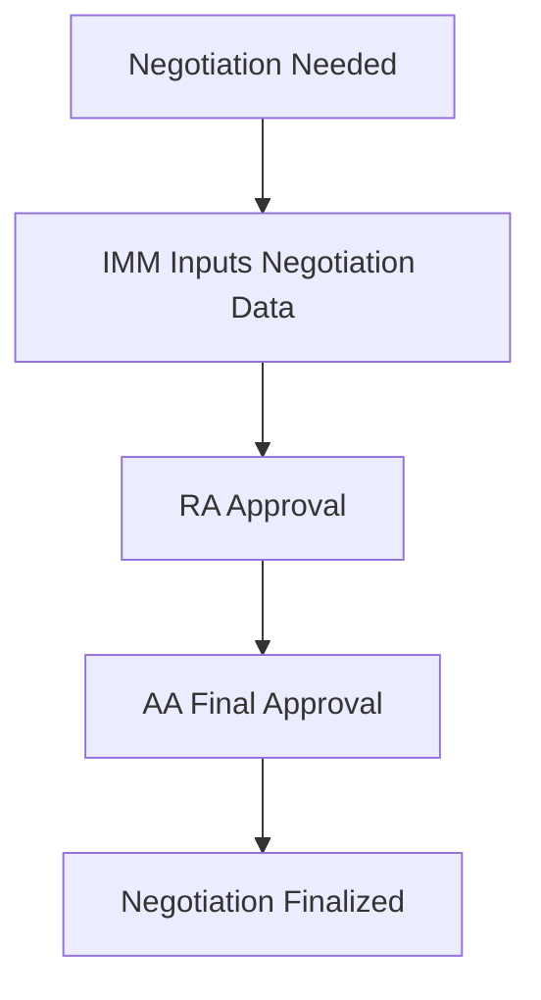
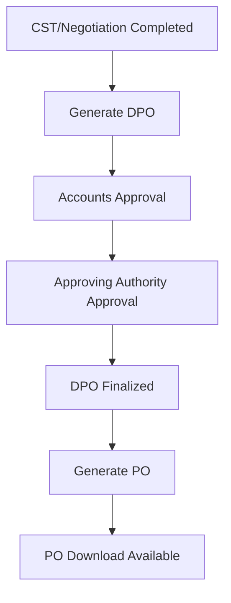
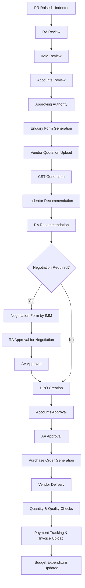
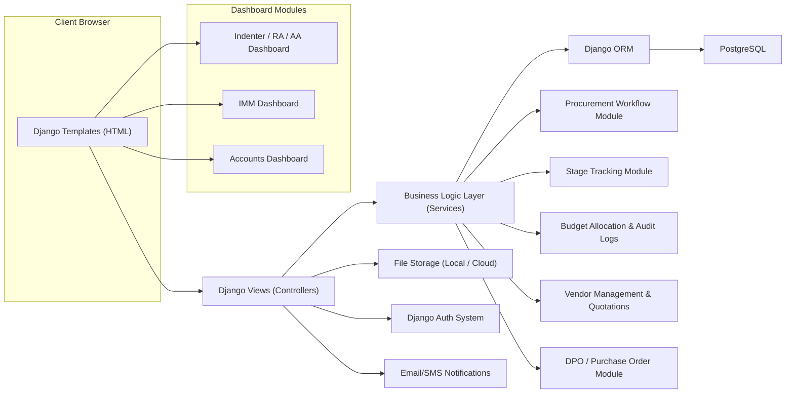
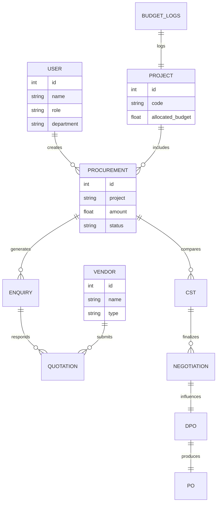

# IMS v2.0 – Integrated Material Management System

### Overview
IMS v2.0 digitizes all procurement operations including vendor onboarding, approvals, comparative statements, negotiations, purchase order issuance, and budget tracking. It ensures transparency, traceability, and compliance through automated workflows and role-based access control.

### System Modules & Descriptions

#### 1. Vendor Registration
Manages vendor onboarding and documentation.  
- Create/update vendor profiles  
- Source category: Import / Indigenous  
- Upload GST, certificates, compliance documents  

#### 2. User Registration
Handles user creation managed by IMM.  
- Captures Name, Employee ID, Department, Email, Phone  
- Role assignment: Indentor, RA, IMM, Accounts, Approving Authority  
- Secured password storage  

#### 3. Dashboards

#### 3.1 Indentor / RA / AA Dashboard
- Procurement status overview  
- Workflow tracking: Enquiry → CST → Negotiation → DPO → PO → Delivery  
- Budget visibility for AA: Available, Allocated, Spent  
- Top 5 vendors by PO counts  
- Project-based filtering and procurement charts  

#### 3.2 IMM Dashboard
- System-wide totals: Vendors, Projects, Procurements  
- Breakdown by procurement stage  
- Top vendors by PO count  
- Doughnut charts for In-progress / Approved / Delivered  

#### 3.3 Accounts Dashboard
- FY-based summary: Projects, Available, Allocated, Spent  
- Budget: FY → Quarter → Month  
- Monthly values: Planned (PR), Committed (PO), Expenditure (Delivered)  
- Drill-down procurement table  
- Filters: All / Import / Indigenous  

---

#### 4. Procurement Workflow (End-to-End)

#### Stage Flow
1. PR Raised  
2. RA → IMM → Accounts → Approving Authority  
3. Enquiry Generation  
4. Vendor Quotations  
5. CST Preparation  
6. Recommendations  
7. Negotiation (Optional)  
8. Draft Purchase Order  
9. Accounts & AA Approval  
10. Purchase Order  
11. Delivery Tracking  

#### Rules
- Any authority may return the PR to any lower role  
- Only Indentor can modify the PR  

---
### Procurement Workflow

#### Descriptions:
- Indentor: Submits PR
- RA: Validates
- IMM: Technical review
- Accounts: Budget check
- AA: Final approval

#### **1. PR Creation**
- The **Indentor** fills and submits the PR Form with all required details.

#### **2. RA Review**
- The PR is routed to the **Recommending Authority (RA)** for validation and approval.

#### **3. IMM Processing**
- After RA approval, the PR moves to **IMM** for technical review and recommendation to Accounts.

### **4. Accounts Review**
- Accounts verifies financial aspects and forwards it to **Approving Authority**.

#### **5. Return Conditions**
- Any higher authority can *return* to any lower authority.
- **Only the Indentor** can modify the PR.

#### **6. Enquiry Generation**

#### Description
- IMM generates the **Enquiry Form**.
- Vendor quotations are uploaded.
  

#### **7. CST (Comparative Statement)**

- IMM prepares the CST and recommends it to the **Indentor**.

#### **8. Indentor Review**

- Indentor reviews CST and forwards to RA.
- Negotiation request can be initiated if required.
  

#### **9. RA Submission**
- RA reviews and submits the form to IMM.

#### **10. DPO (Draft Purchase Order)**

- Upon negotiation or RA submission, it moves to **DPO Stage**.

#### **11. IMM Approval → Accounts**
- IMM approves and sends to Accounts.

#### **12. Accounts Approval**
- If approved, the process repeats for remaining items (if any).

#### **13. Final PO Approval**
- PO is approved.
- Any forwarded user must upload the signed copy.

### 5. Functional Components

#### 5.1 Enquiry Form Generation
- Generated after procurement approval.
- IMM can add extra vendors.
- Quotation upload per vendor (optional).
- Download enquiry form + all documents.

#### 5.2 Comparative Statement (CST)
- Created only for vendors who uploaded quotations.
- Alerts for missing quotations.
- Single vendor mode supported.
- Ranking based on:
  - Lowest price
  - Delivery time
- Must be recommended by Indentor & RA.

#### 5.3 Negotiation
- Triggered only if Indentor & RA decide.
- IMM submits negotiated values.
- RA + Approving Authority approval mandatory.
- Downloadable negotiation form.

#### 5.4 Draft Purchase Order (DPO)
- Shows CST or negotiated values.
- Editable fields: Discount & GST.
- Delivery timeline (weeks) & warranty (months).
- RI → Accounts → Approving Authority approval.
- Downloadable DPO.

#### 5.5 Purchase Order (PO)
- Auto-generated 9-digit PO number:
  - Digit 1: Source (1 Indigenous, 2 Import)
  - Digit 2–4: Project Code
  - Digit 5–7: Serial Number
  - Digit 8–9: Financial Year
- Downloadable PO.

---

### 6. Budget Allocation & Tracking Module

#### Key Features
- Allocate budgets per project per FY.
- Increase/Decrease budgets anytime.
- Monthly visualization of:
  - Planned  
  - Committed  
  - Expenditure  
- Import/Indigenous filters.
- Complete audit log:
  - Change timestamp
  - User
  - Reason for modification

---

### 7. System Models (Entity Definitions)

#### **Vendor**
- vendor_id  
- name  
- address  
- email  
- phone  
- source_of_make (Import/Indigenous)  
- documents  

#### **User**
- user_id  
- name  
- employee_id  
- department  
- role  
- email  
- phone  
- password_hash  

#### **Project**
- project_id  
- project_code  
- name  
- budget_allocations (relationship)

#### **Procurement**
- procurement_id  
- project_id  
- created_by  
- status  
- source_of_make  
- amount  

#### **Quotation**
- quotation_id  
- procurement_id  
- vendor_id  
- amount  
- delivery_time  
- attached_files  

#### **CST**
- cst_id  
- procurement_id  
- vendor_rankings  

#### **Negotiation**
- negotiation_id  
- procurement_id  
- negotiated_amount  
- negotiated_delivery_time  

#### **DPO**
- dpo_id  
- procurement_id  
- amount  
- gst  
- discount  
- delivery_time  
- warranty  

#### **PO**
- po_id  
- procurement_id  
- po_number  

#### **Budget Allocation**
- allocation_id  
- project_id  
- financial_year  
- allocated_amount  
- spent_amount  
- audit_logs (relationship)

---

### 8. Entity Relationship Summary

**Project**  
→ has many **Procurements**  
→ has many **Budget Allocations**

**Procurement**  
→ belongs to **Project**  
→ has many **Quotations**  
→ has one **CST**  
→ has one **Negotiation**  
→ has one **DPO**  
→ has one **PO**

**Vendor**  
→ provides many **Quotations**

**User**  
→ creates **Procurement**  
→ performs approvals at various stages  

---

### 9. Process Flow Diagram

### 10. System Flow Diagram

### 11. Data Relationship Flow Diagram

This ER-style diagram 

# License
Proprietary — Internal Use Only.

# Support
Contact IMM Administrator.

## 📌 Sitemap

### Dashboard
- **Indicators**
  - Vendors
  - Projects
  - Procurements
  - Enquiry Generated
  - CST
  - For Negotiation
  - DPO
  - PO
  - Delivery
- **Tables**
  - Top 5 Vendors
  - Procurement Table

### INBOX
- Received PR
- Returned PR

### Approved PR
- PR List
- Enquiry Form
- CST
- Negotiation

### Registration
- Project
- User Registration
- Vendor Master
- PO Create
- Reset Password

### MIS
- **Indicators**
  - Procurements
  - Planned
  - Committed
  - Expenditure
- **Table View**
- **Query Filters**

### DPO
- Filters

### Invoice
- Filters

### PO
- Filters

### Tracking
- Filters

### Profile
- Profile Overview / Settings

### Feedback
- Free Text Input
